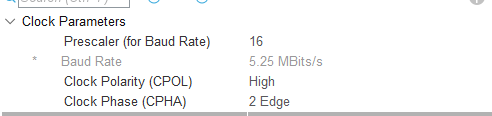

# Library for handling LIS3DSH accelerometer with STM HAL using SPI

## SPI Configuration
SPI periphial must be configured following way.
 

 
Baud rate must be <= 10MBits and SPI must work in mode 3 (CPOL = 1 and CPHA = 1). You also need to setup CS pin as GPIO output.

## Example Use
To read acceleration create struct handlig sensor and initalize it. Default setting setup object with 2G sensivity and 1600Hz sampling rate.
<pre>
  LIS3DSH_Handler handler_LIS3DSH;
  handler_LIS3DSH.settings = LIS3DSH_default_settings;
  handler_LIS3DSH.GPIO = GPIOE;
  handler_LIS3DSH.GPIO_Pin = GPIO_PIN_3;
  handler_LIS3DSH.hspi = &hspi1;
  LIS3DSH_init(&handler_LIS3DSH);
</pre>
You can modify sampling rate and sensivity with folllowing functions:
<pre>
LIS3DSH_set_sampling_rate(&handler_LIS3DSH,LIS3DSH_SMP_400HZ);
LIS3DSH_set_scale(&handler_LIS3DSH, LIS3DSH_SCALE_16G);
</pre>

Data can be read from sensor if two forms, as raw sensor output or as mg unit(1/1000  of earth acceleration). Second way is more computing intensive due to floating point calculations. Checking if acceleration was updated and read it is  done with:
<pre>
    if(LIS3DSH_check_for_data(&handler_LIS3DSH))
    {
      LIS3DSH_read_acc_mg(&handler_LIS3DSH);
    }
</pre>

